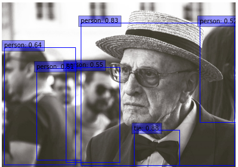
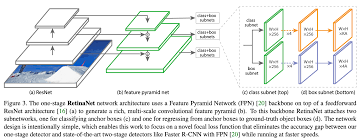
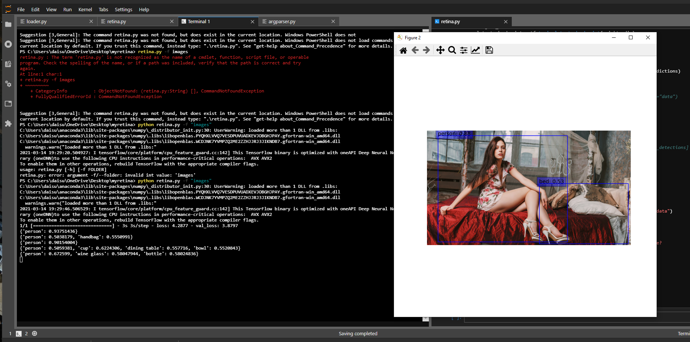
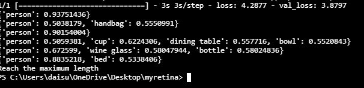

# RetinaNet-project

Keras implenmentation of RetinaNet. \

# Retinanet 
The highest accuracy object detectors to date are based on a two-stage approach popularized by R-CNN, where a classifier is applied to a sparse set of candidate object locations. In contrast, one-stage detectors that are applied over a regular, dense sampling of possible object locations have the potential to be faster and simpler, but have trailed the accuracy of two-stage detectors thus far. In this paper, we investigate why this is the case. We discover that the extreme foreground-background class imbalance encountered during training of dense detectors is the central cause. We propose to address this class imbalance by reshaping the standard cross entropy loss such that it down-weights the loss assigned to well-classified examples. Our novel Focal Loss focuses training on a sparse set of hard examples and prevents the vast number of easy negatives from overwhelming the detector during training. To evaluate the effectiveness of our loss, we design and train a simple dense detector we call RetinaNet. Our results show that when trained with the focal loss, RetinaNet is able to match the speed of previous one-stage detectors while surpassing the accuracy of all existing state-of-the-art two-stage detectors. \

with prediction scores \
.png)

# Update
- Add ImageLoader method 3/13
- Add Argumentparser 3/14

Make an inference of images which are in a folder typed as argument of command line

Terminal shows the result of inference with float number \

# Todo
- Try different benchmarks
- Try with different layers
- Normalization free model → Poor Performance with pre-made module. 

# References:
- [Focal Loss for Dense Object Detection](https://arxiv.org/abs/1708.02002). Tsung-Yi Lin, Priya Goyal, Ross Girshick, Kaiming He, Piotr Dollár. ICCV, 2017.
- [Feature Pyramid Networks for Object Detection](https://arxiv.org/abs/1612.03144). Tsung-Yi Lin, Piotr Dollár, Ross Girshick, Kaiming He, Bharath Hariharan, Serge Belongie. CVPR, 2017.
- Keras RetinaNet: https://github.com/fizyr/keras-retinanet
